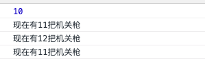

# redux


**简介**

* 专注于状态管理的库 和 react 解耦
* 单一状态 单向数据流
* 核心概念: 
  * store
  * state
  * action 
  * reducer

**主要功能**

* 首先通过 reducer 新建 store 随时通过 store.getState 获取状态
* 需要状态变更 store, dispatch\(action\) 来修改状态
* Reducer 函数接受 state action 返回新的 state 可以用 store.subscribe 监听每次修改

```text
yarn add redux
```

```text
import { createStore } from 'redux'

// reducer
const counter = (state=0, action) => {
  switch(action.type){
    case 'add':
      return state + 1
    case 'reduce':
      return state - 1
    default:
      return 10
  }
}

// 创建 store
const store = createStore(counter)
const init = store.getState()
console.log(init) // 10

const listener = () => {
  const current = store.getState()
  console.log(`现在有${current}把机关枪`)
}

// 每次状态变化 均会触发 listener 函数
store.subscribe(listener)

// 派发事件 传递 action
store.dispatch({type: 'add'})
store.dispatch({type: 'add'})
store.dispatch({type: 'reduce'})
```



**redux 结合 react 使用**

* 把 store.dispatch 方法传递给组件 内部可以调用修改状态
* Subscribe 订阅 render 函数 每次修改都重新渲染
* Redux 相关内容 移到单独的文件 index.redux.js 单独管理

